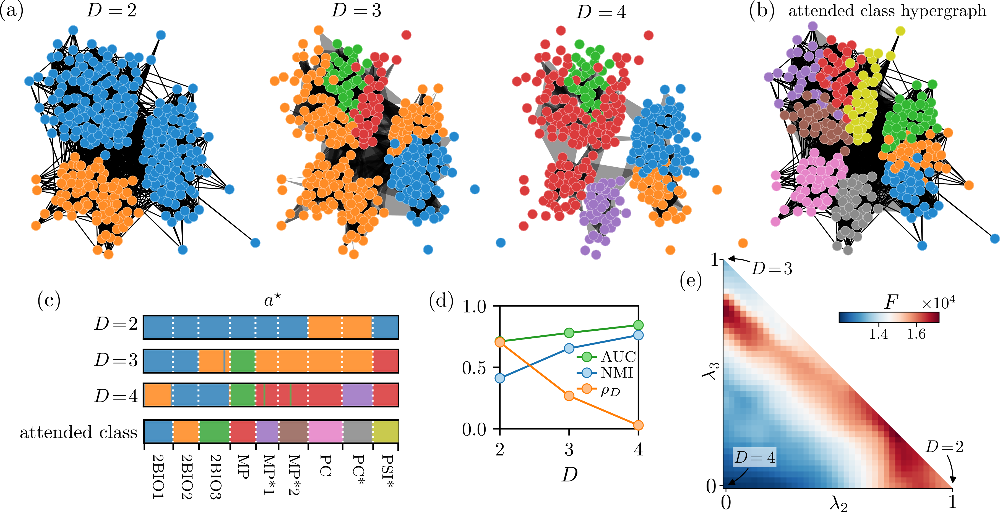

<h1 align="center">
Message Passing on Hypergraphs
</h1>

<p align="center">
<i>Inference and theoretical study of higher-order community structures</i>
</p>

<p align="center">
<a href="https://github.com/nickruggeri/Hy-MMSBM/blob/main/LICENSE" target="_blank">

</a>

<a href="https://www.python.org/" target="_blank">

</a>

<a href="https://github.com/psf/black" target="_blank">

</a>

<a href="https://arxiv.org/abs/2212.08593" target="_blank">

</a>

<a href="https://www.treedom.net/en/user/nicolo-ruggeri-7568/trees/ZMG-8DNK" target="_blank">

</a>

</p>
<br/>


<br/>

This repository contains the implementation of the methods presented in

&nbsp;&nbsp;
**[1]** <i> Message-Passing on Hypergraphs: Detectability, Phase Transitions and 
Higher-Order Information</i><br/>
&nbsp;&nbsp;&nbsp;&nbsp;&nbsp;&nbsp;&nbsp;
Nicolò Ruggeri*, Alessandro Lonardi*, and Caterina De Bacco<br/>
&nbsp;&nbsp;&nbsp;&nbsp;&nbsp;&nbsp;&nbsp;
[
        <a href="https://arxiv.org/abs/2312.00708" target="_blank">arXiv</a>
]


Below, we explain how to run the Message-Passing (MP), Expectation-Maximization (EM) and
sampling procedures presented in the paper. </br>
The code is made available for the public, if you make use of it please cite our work
in the form of the reference **[1]** above.

<h2>Code installation</h2>

The code was developed utilizing <b>Python 3.9</b>, and can be downloaded and used locally as-is. <br>
To install the necessary packages, run the following command

`pip install -r requirements.txt`


<h2>Message passing</h2>

It is possible to run message passing and infer the marginal probabilities of nodes to
belong to certain communities, while conditioning on given community priors `n` and
affinity matrix `p`. To do so, execute the command:

```python
python main_message_passing.py --em_iter 1 --mp_iter 2000 --mp_thresh 1e-5
--mp_patience 50 --dropout 0.75 --seed 123 --save_dir ./mp_results
--hye_file ./data/synthetic/sample.txt --n ./data/synthetic/n_prior.txt
--p ./data/synthetic/p_phase_transition_1.txt --K 4
```

The results will be saved in the output folder, and contain the node marginal
probabilities, messages from nodes to hyperedges, messages from hyperedges to nodes,
and free energy. Also convergence diagnostics are included, namely the difference in
estimated marginal between consecutive MP iterations.

The main arguments accepted are:
- `real_dataset` or `hye_file`: the dataset to run inference on (see more on input data
format below).
- `max_hye_size`: the maximum hyperedge size accepted. All hyperedges with higher size
are discarded during inference.
- `n`, `p`: fixed parameters given to the model, they will not be updated.
`n` is the prior distribution of the communities, `p` the affinity matrix, both in a
format to be loaded via `numpy.loadtxt`.
- `K`: number of communities in the model. If `n` and/or `p` are provided, they must
respectively have shapes `(K,)` and `(K, K)`.
- `mp_iter`, `mp_thresh`, `mp_patience`: setting the  maximum number of MP iterations.
If for more than a consecutive number of iterations (specified by `mp_patience`) the
change in marginal probabilities falls below the threshold, inference is stopped. Otherwise,
inference stops when the maximum number of iterations `mp_iter` has been reached.
- `dropout`: the percentage of randomly dropped messages in the MP updates.
- `save_dir`: the folder where results are saved.
- `seed`: random seed.

**Input data format**
A hypergraph is saved as a list of hyperedges. Therefore, the
script accepts hyperedge lists both in pickle and text format, as in the example
files `./data/synthetic/sample.pkl` and `./data/synthetic/sample.txt`.
Importantly, nodes are numbered from _0_ to _N-1_, where _N_ is the total number of
nodes.


<h2>Expectation-Maximization inference</h2>

Running EM inference allows inferring all the parameters of the model directly from the
data. Specifically, if _K_ is the number of communities, one can infer the following
values:

- _n_, the vector of length _K_ where the entries specify the frequencies of the inferred communities
- _p_, the _K x K_ symmetric affinity matrix

as well as the values inferred from message passing, see [above](#message-passing).
Convergence diagnostics for EM are included: the difference in _n_ and _p_ values
between consecutive EM iterations.

Inference is run via the relative script `main_message_passing.py`. For example, to run
inference on the High School dataset utilized in the paper, run

```python
python main_message_passing.py --real_dataset high_school --seed 234 --max_hye_size 5
--em_iter 20 --em_thresh 1e-5 --mp_iter 2000 --mp_thresh 1e-5 --mp_patience 50 --K 10
--dropout 0.99 --save_dir ./high_school_results
```

<h2>Sampling synthetic data</h2>

In the paper, we also present a new sampling algorithm that generates hypergraphs from
the probabilistic model. For example, samples similar to those in `./data/synthetic` are
obtained as:

```python
python main_sampling.py --p ./data/synthetic/p_phase_transition_1.txt --max_hye_size 50  
--node_assignments ./data/synthetic/node_assignment_phase_transition.txt
--allow_repeated True --seed 345 --save_dir ./sampling_results
```

The main arguments are:
- `p` the affinity matrix.
- `max_hye_size` the maximum size of the sampled hyperedges.
- `node_assignments` the array of node assignments to the communities. See the
referenced file for an example structure.
- `allow_repeated` whether to allow repeated hyperedges. If False, it allows for faster
sampling and the approximation is negligible in sparse regimes.
- `seed` random seed.
- `save_dir` output path specifying the directory where results are saved.
